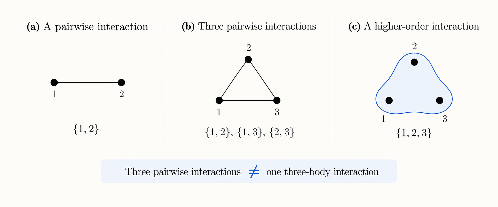

Networks are everywhere.

Social networks, power grids, transportation systems, neural networks, the basic idea is always similar: we have a collection of things and some way of describing how they interact.

Mathematically, one of the simplest ways of representing this idea is through a graph.

## networks: nodes and edges

A graph is made of two basic things: nodes and edges.

The nodes represent the elements of the system, while the edges represent interactions between them.

More formally, a graph can be written as

$$
G = (V,E),
$$

where $V$ is the set of nodes and $E$ is the set of edges.

For example, if

$$
V = \{1,2,3\},
$$

we could have

$$
E = \{\{1,2\},\{2,3\},\{1,3\}\}.
$$

There is something important hiding in this notation.

Every edge contains two nodes.

In other words, the usual graph representation assumes that interactions are **pairwise**.

For a surprisingly large number of problems, this works extremely well.

But not always.

## what if an interaction involves more than two things?

Suppose three nodes are not interacting through three independent pairwise relationships.

Instead, imagine that something happens only when all three participate simultaneously.

If we represent this interaction using an ordinary graph, we might draw a triangle. But in doing so, we have changed the meaning of the interaction.

The triangle represents three pairwise interactions:

$$
\{1,2\}, \qquad \{2,3\}, \qquad \{1,3\}.
$$

What we actually wanted to describe was one interaction involving three nodes.

These are not the same thing.

{#fig-hypergraph fig-align="center" width="100%"}

And this is where hypergraphs enter the story.

## hypergraphs

A hypergraph relaxes the requirement that an edge must connect exactly two nodes.

Instead of edges, we have hyperedges, and a hyperedge can contain more than two nodes.

We can write a hypergraph as

$$
\mathcal{H} = (V,\mathcal{E}),
$$

where $V$ is again the set of nodes, while $\mathcal{E}$ is a set of hyperedges.

For our three-node example, we could have

$$
V = \{1,2,3\}
$$

and

$$
\mathcal{E} = \{\{1,2,3\}\}.
$$

That single hyperedge represents one interaction involving all three nodes simultaneously.

This gives us an important distinction:

$$
\{\{1,2\},\{2,3\},\{1,3\}\}
\neq
\{\{1,2,3\}\}.
$$

The object on the left describes three pairwise interactions.

The object on the right describes one three-body interaction.

They involve exactly the same nodes, but they encode different structures.

## higher-order networks

Hypergraphs are one way of describing what are broadly called **higher-order networks**.

The term refers to network representations in which interactions are not restricted to pairs of nodes.

Hypergraphs are perhaps the most direct example, but they are not the only possibility. Simplicial complexes, for instance, provide another way of representing higher-order structure, with additional constraints on how interactions of different orders are related.

There are also different mathematical representations of the same higher-order system, and, as I have been discovering during my PhD, moving between these representations is not always as innocent as it first appears.

The structure we choose to represent a system determines what information is explicit, what information is hidden, and what mathematical tools we can use to study it.

## and beyond

This is where things start getting interesting for me.

Once we have a higher-order network, we can start asking many of the questions that we already ask for regular networks:

- Does the network have symmetries?
- Can different nodes be structurally equivalent?
- Can groups of nodes synchronize?
- Can the structure tell us which synchronization patterns are possible?
- And what happens when the usual notion of symmetry is not enough?

Those are much closer to the questions I'm currently working on.

So this post is just the beginning.

Before talking about synchronization, automorphisms, or why I've recently been thinking about groupoids much more than I ever expected to, we first needed a network.

Then we add some new structures.

And somehow things got considerably more complicated from there.